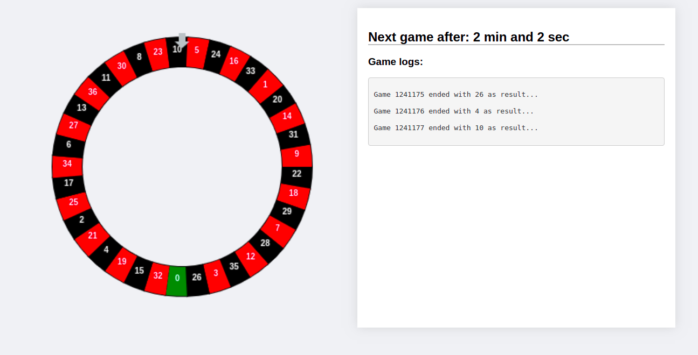

# Roulette

Code challenge for creating roulette.



## Application structure

The application is structured by features. All components and styling are placed in so called feature folder that are relevant to that feature / concern. Right now,  application have only one page (roulette), but it can be easy scaled to more.

```
├── src
│   ├── App.scss
│   ├── App.test.tsx
│   ├── App.tsx
│   ├── core
│   │   ├── createRouter.ts
│   │   ├── settings.ts
│   │   ├── styles
│   │   └── utils.ts
│   ├── index.scss
│   ├── index.tsx
│   ├── notFound
│   │   └── NotFoundPage.tsx
│   ├── registerServiceWorker.ts
│   └── roulette
│       ├── InfoBox.scss
│       ├── InfoBox.tsx
│       ├── rouletteEffects.ts
│       ├── RoulettePage.scss
│       ├── RoulettePage.tsx
│       ├── Roulette.scss
│       └── Roulette.tsx

```


## What was used for application state management

Basically, Hooks API was used since application is not complex and it is enough to use new Hooks API to keep code clean and easy to understand, but it can be easily extended with redux or similar state management library.


## What is missing

* Almost no tests was written :(
* Still it would be nice to implement board with statistical data


## How to run application

**create-react-app**  cli was used for bootstrapping project, so it can be run by:

`yarn install && yarn start`

For more details look at **create-react-app** documentation.

## Knowan bugs

* When results comes as 0 roulette never stops :(

